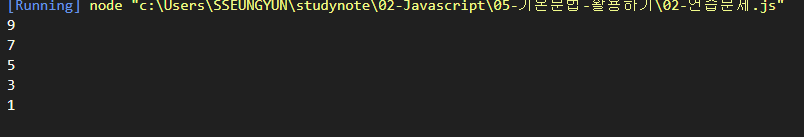
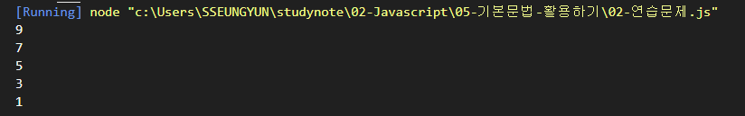
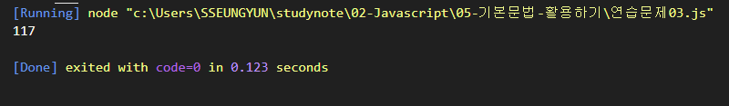
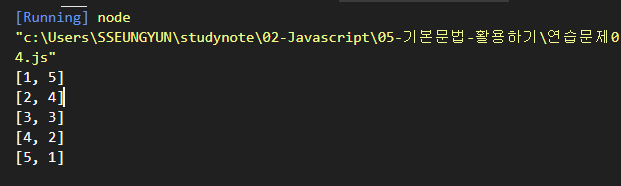
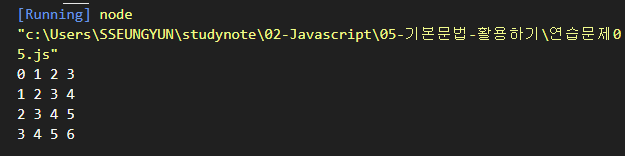
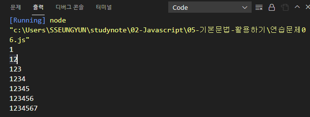
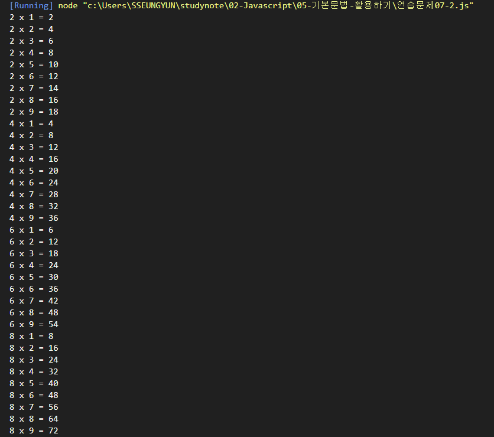

## 신승윤 

22-01-27

---

# 기본문법 활용하기 연습문제

## 문제 1.

for문을 사용하여 0부터 10미만의 정수 중에서 홀수만을 큰수부터 출력하시오.

```javascript

for(let i=9; i>0; i=i-2){
 console.log("%d", i);
    
}

    

```
### 실행결과

---
## 문제 2.

while문을 사용하여 0 부터 10 미만의 정수 중에서 홀수만을 큰수부터 출력하시오.

```javascript

for(let i=9; i>0; i=i-2){
 console.log("%d", i);
    
}

    
```
### 실행결과

---
## 문제 3.

1부터 20 미만의 정수 중에서 2 또는 3의 배수인 수의 총합을 구하시오.

```javascript

let sum = 0;

for (let i=1; i<20; i=i+1) {
    if (i % 2 == 0 || i % 3 == 0) {
        sum = sum+i;
    }
}

console.log(sum);
```
### 실행결과

---

## 문제 4.

두 개의 주사위를 던졌을 때, 눈의 합이 6이 되는 모든 경우의 수를 출력하고 경우의 수는 총 몇가지 인지를 아래와 같이 출력하는 코드를 작성하시오.

```
[ 1, 5 ]
[ 2, 4 ]
[ 3, 3 ]
[ 4, 2 ]
[ 5, 1 ]
경우의 수는 5개 입니다.
```

```javascript

for (let i=1; i<=6; i++) {
    //두 번째 주사위의 반족
    for (let j=1; j<=6; j++) {
        if(i + j == 6) {
            console.log("[%d, %d]", i, j );

            // 조건이 충족될때 마다 1씩 증가 --> 갯수 세기
            count++;
        }
    }
}


```
### 실행결과

---
## 문제 5.

for문을 중첩하여 실행하여 아래와 같은 출력 결과를 만드시오.

```
0 1 2 3 
1 2 3 4 
2 3 4 5 
3 4 5 6 
```

```javascript

// 가로 세로 일정하면 반복문 무조건 겹침.
// 행의 수와 열의 수를 고려해야 한다. 4행 4열

for(let i=0; i<4; i++) {  //4행만들기

    // 한 줄에 출력할 문자열 변수
    let str = "";

    for (let j=0; j<4; j++) {//4열 만들기
        str += i+j;

        if (j+1 <4) {
            str = str + " ";
        }
    
    }

    console.log(str);
}

```
### 실행결과

---
## 문제 6.

아래와 같은 출력 결과가 나타나도록 중첩 반복문을 for 문 형식으로 구현하시오.

```
1
12
123
1234
12345
123456
1234567
```

```javascript


for(let i=0; i<7; i=i+1){
    let str ="";

    for(let j=0; j<i+1; j=j+1){
        str += j+1;
    }

    console.log(str);
}

```
### 실행결과

---

## 문제 7.

number라는 변수를 정의하고 1 혹은 2의 값을 임의로 할당하시오. 이 변수에는 1이나 2밖에 저장될 수 없습니다.

구구단 프로그램을 만들고자 한다.

전체를 출력하는 구구단이 아니라 number가 1일 때는 홀수 단(3, 5, 7, 9), number가 2일 때는 입력하면 짝수 단(2, 4, 6, 8)을 출력하는 프로그램을 완성하시오.


```javascript
const number= 2; // 2,4,6,8
//const number = 1; // 3,5,7,9

let start = number == 2 ? 2 : 3;

for  (let i=start; i<10; i+=2) {
    for (let j=1; j<10; j++) {
        console.log("%d x %d = %d" , i , j , i*j);
    }
}
```
### 실행결과



