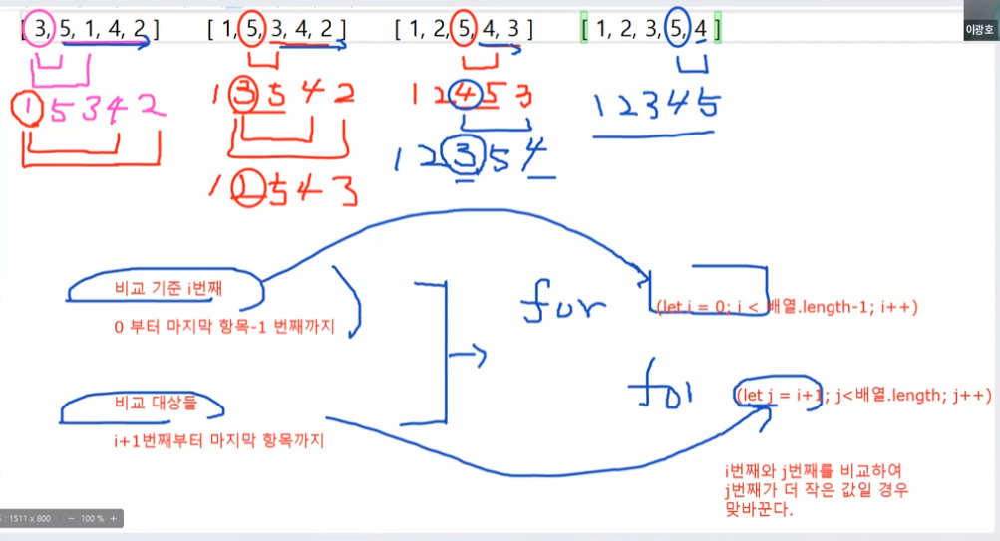

# 배열

## #01. 배열의 이해

### 1) 배열의 필요성

학급의 성적표를 보고 각 학생별로 총점과 평균을 구해야 한다고 가정할 때,

| 이름 | 국어 | 영어 | 수학 |
|---|---|---|---|
| 철수 | 92 | 81 | 77 |
| 영희 | 72 | 95 | 98 |
| 민혁 | 80 | 86 | 84 |

성적표가 아래와 같다면 3명씩 3과목이므로 총 9개의 변수가 필요할 것이다.


```jsx
var kor1 = 92;
var kor2 = 71;
var kor3 = 80;
// ... 생략 ...
var math2 = 84;
var math3 = 98;
```

만약 30명의 학생에 대한 20과목에 대한 점수라고 가정한다면 생성해야 하는 변수가 더 증가하므로 프로그램은 좀 더 복잡해 질 것이다.

배열은 이러한 경우를 해소하기 위한 자바스크립트 자료구조의 하나로, 변수에 여러 개의 데이터를 그룹화해서 저장해 놓은 상태를 말한다.

### 2) 배열 생성하기

#### 배열의 선언

Javascript는 변수의 특성이 값이 할당 될 때 결정되기 때문에 선언은 일반 변수와 동일하다.

즉, 할당하기 전까지는 숫자, 문자열, 배열 등의 구분이 없다.

```jsx
let myArr;
```

#### 배열의 할당

대괄호(`[]`)안에 포함할 값들을 데이터 타입의 구분 없이 콤마(`,`)로 구분하여 나열한다.

선언과 할당이 나누어져 있는 경우 `const` 로 선언할 수 없다.

myArr = [1, 2, 3.14, true, false, "hello", "world"];

#### 선언과 할당의 통합

```js
let myArr = [1, 2, 3, 5, 7];
```

#### Array 클래스를 사용한 할당

`new Array(...)` 형식으로 생성한다.

```js
let newArr1 = new Array("hello", "world", 1, 2, 3, true, false);
```

| 클래스는 아직 소개되지 않은 개념이므로 여기서는 명렁어의 일종으로 받아들이시기 바랍니다.

#### Array 클래스 사용시 주의할 점

`new Array()`로 배열을 생성할 때 `()`안에 숫자 값 하나만 명시되는 경우, 숫자 값 만큼의 빈 칸을 갖는 배열이 생성된다.

배열의 각 칸은 모두 정의되지 않은 값(**undefined**)로 할당된다.


### 3) 배열의 원소에 접근하기

배열의 각 원소는 0부터 시작하는 일련번호를 부여 받는데, 이를 배열의 **인덱스** 라고 한다.

배열의 원소에 접근할 때는 인덱스 번호를 활용하여 접근해야 한다.

```jsx
let myArr = [1, 2, 3.14, true, false, "hello", "world"];
console.log(myArr[0]);
console.log(myArr[2]);
console.log(myArr[4]);
console.log(myArr[6]);
```

존재하지 않는 원소의 값을 출력하고자 할 경우, 정의되어 있지 않으므로 **undefined**가 된다.

### 4) 배열의 크기

`배열이름.length`는 배열의 칸 수를 반환한다.

배열의 인덱스는 항상 `0`부터 `크기-1`까지 1씩 증가하면서 존재한다.

### 5) 반복문을 통한 활용

배열은 인덱스가 0부터 1씩 배열의 길이보다 작은 동안 순차적으로 증가한다는 특성이 있다.

반복문의 초기식을 0으로, 조건식을 길이보다 작은 동안, 증감식을 1씩 증가로 설정한 반복문과 함께 사용하는 것이 일반적이다.

이와 관련하여 다양한 예제 패턴들이 존재한다.


## #02. 2차 배열

1차 배열의 각 원소가 다른 배열로 구성된 형태.

**열**의 개념만 존재하는 1차 배열에 **행**의 개념을 추가한 형태가 2차 배열 이다.

### 1) 2차 배열 생성하기

`[]`를 사용하여 1차원을 표현하고 그 안에 다시 `[]`를 콤마로 구분하여 2차원을 구성한다.

```js
const myarr = [ [ ... ], [...] ]
```

### 2) 2차 배열의 원소에 접근하기

2행 3열인 경우 행의 인덱스는 0부터 1까지, 열의 인덱스는 0부터 2까지 존재한다.

배열에 저장된 원소에 접근하기 위해서는 변수이름 뒤에 행, 열의 순서로 인덱스를 명시한다.

### 3) 2차 배열의 행, 열 크기 구하기

#### 행의 크기

2차 배열에 대한 길이를 직접 구하면 행의 크기를 알 수 있다.

#### 열의 크기

2차 배열의 모든 행에 대한 열 크기가 항상 동일하다는 보장이 없기 때문에 열의 크기는 각 행마다 개별적으로 구해야 한다.

### 4) 가변배열

2차 배열의 정확한 개념은 1차 배열의 각 원소가 다른 배열로 구성된 형태이다. 

원소로서 포함되는 각 배열의 크기가 동일하지 않은 경우를 가변 배열이라고 한다.

항상 배열의 모든 행이 동일한 열로 구성되는 것은 아니다. (모든 줄의 칸 수가 같다는 보장은 없다는 의미)

> 가변배열이 자주 등장하는 것은 아니다. 95% 이상의 경우가 모든 행마다 열 크기가 동일한 경우이다.

### 5) 2차 배열과 반복문

#### 배열의 모든 원소 스캔하기

2차 배열의 모든 원소를 반복문으로 스캔하기 위해서는 **중첩 반복문**을 사용해야 한다.

이 때 부모 반복문은 **행**에 대해 관여하고, 자식 반복문은 **열**에 대해 관여한다.

### 6) 정렬루틴

