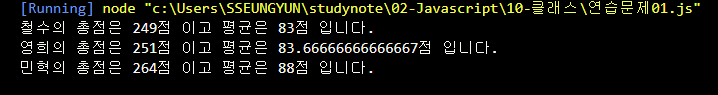
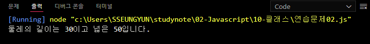
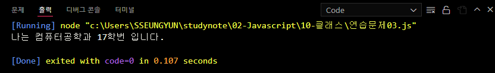

# 신승윤 Class 기반 객체지향 연습문제
# 2022-02-10

## 문제1.

앞 단원에서 수행한 연습문제 1,2번을 Class 기반의 객체지행으로 재구성하시오.

```js
class Student {
    constructor(kor, eng, math) {
        this._kor = kor;
        this._eng = eng;
        this._math = math;
    }

    sum() {
        return this._kor + this._eng + this._math;
    }

    avg() {
        return this.sum() / 3;
    }
}

const s1 = new Student(92, 81, 76);
const s2 = new Student(72, 95, 84);
const s3 = new Student(80, 86, 98);
console.log("철수의 총점은 %d점 이고 평균은 %d점 입니다.", s1.sum(), s1.avg());
console.log("영희의 총점은 %d점 이고 평균은 %d점 입니다.", s2.sum(), s2.avg());
console.log("민혁의 총점은 %d점 이고 평균은 %d점 입니다.", s3.sum(), s3.avg());
```
실행결과


---
## 문제2
```js
class Reatangle {
    constructor() {
        this._width = null;
        this._height = null;
    }

    get width() {
        return this._width;
    }

    set width(param) {
        this._width = param;

    }

    get height() {
        return this._height;
    }

    set height(param) {
        this._height = param;
    }

    getAround() {
        return this.width * 2 + this.height * 2;
    }

    getArea() {
        return this.width * this.height;
    }
}

const rect = new Reatangle();
rect.width = 10;
rect.height = 5;

consolo.log("둘레의 길이는 %d이고 넓은 %d입니다." , rect.getAround(), rect.getArea());
```
실행결과

---
## 문제3

```
문제 1 - 다음을 만족하는 Student 클래스를 작성하시오.

1) String형의 학과와 정수형의 학번을 프로퍼티로로 선언후 생성자를 통해 주입
2) getter, setter를 정의
3) sayHello() 메서드를 통해 "나는 OOOO학과 OO학번 입니다." 를 출력하는 기능을 구현

```
```js
class Student {
  constructor(depart, studentId) {
    this._depart = depart;
    this._studentId = studentId;
  }

  get depart() {
    return this._department;
  }

  set depart(depart) {
    this._department = depart;
  }

  get studentId() {
    return this._studentId;
  }

  set studentId(studentId) {
    this._studentId = studentId;
  }

  sayHello() {
    console.log("나는 %s과 %d학번 입니다.", this.depart, this.studentId);
  }
}

const stu = new Student();
stu.depart = "컴퓨터공학";
stu.studentId = "17"
stu.sayHello();

```
실행결과

---
## 연습문제 4.
```
/**
문제 - 2. 다음을 만족하는 클래스 Account를 작성하시오.

1) 다음의 2 개의 필드를 선언
    문자열 owner; (이름)
    숫자형 balance; (금액)
2) 위 모든 필드에 대한 getter와 setter의 구현
3) 위 모든 필드를 사용하는 가능한 모든 생성자의 구현
3) 메소드 deposit()의 헤드는 다음과 같으며 인자인 금액을 저축하는 메소드
    deposit(amount)
4) 메소드 withdraw()의 헤드는 다음과 같으며 인자인 금액을 인출(리턴)하는 메소드
    withdraw(long amount)
    인출 상한 금액은 잔액까지로 하며, 이 경우 이러한 상황을 출력
 */

```

```js
class Account {
    /** 생성자 */
    constructor(owner, balance) {
        //문자열 owner; (이름)
        this._owner = owner;
        //숫자형 balance; (금액)
        this._balance = balance;
    }

    get owner() {
        return this._owner;
    }

    set owner(value) {
        this._owner = value;
    }

    get balance() {
        return this._balance;
    }

    get balance(value) {
        this._balance = value;
    }

    /** 인자인 금액을 저축하는 메소드 */
    disposit(amount) {
        this.balance += amount;

    }

    withdraw(amount) {
        // 인출 상한 금액은 잔액까지로 하며, 이 경우 이러한 상황을 출력
        if (this.balance < amount) {
            console.log("잔액이 부족합니다.");
            return 0;
        }

        this.balance -= amount;
        return amount;
    }
}

const acc = new Account("Hello", 15000);

// Hello의 잔액은 15000원
console.log("%s의 잔액은 %d원", acc.owner, acc.balance);

// 저축
acc.disposit(5000);
// Hello의 잔액은 20000원
console.log("%s의 잔액은 %d원", acc._owner, acc.balance);

acc.disposit(15000);
// Hello의 잔액은 5000원
console.log("%s의 잔액은 %d원", acc._owner, acc.balance);

acc.disposit(5000);
// Hello의 잔액은 10000원
console.log("%s의 잔액은 %d원", acc._owner, acc.balance);

acc.disposit(15000);
// 잔액이 부족합니다.
// Hello의 잔액은 10000원
console.log("%s의 잔액은 %d원", acc._owner, acc.balance);
```