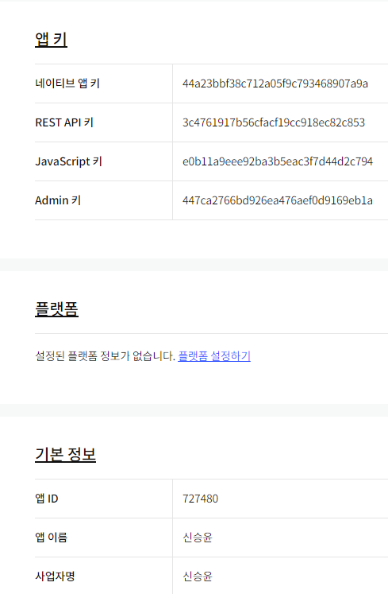

## 신승윤 시험 

### 2022-04-06 


#### <KAKAO 인증 키 받기>


#### <HTML 구조 설계>


#### <HTML 및 CSS 코드 : test.html>
```html
<!DOCTYPE html>
<html lang="en">
<head>
    <meta charset="UTF-8">
    <meta http-equiv="X-UA-Compatible" content="IE=edge">
    <meta name="viewport" content="width=device-width, initial-scale=1.0">
    <title>Document</title>
    <style>
        #loading {
          width: 100px;
          height: 100px;
          background-image:  url(img/loading.gif);
          background-size: cover;
          background-repeat: no-repeat;
          background-position: center center;
          display: block;
          position: absolute;
          left: 50%;
          top: 50%;
          margin-left:  -50px;
          margin-top: -50px;
          z-index: 9999999999999;
          display: none;
      }

      #loading.active {
          display: block;
      }

      body {
          font-family: Arial;
          padding-top: 0px;
      }

      #header {
          position: fixed;
          top: 0;
          left: 0;
          width: 100%;
          background-color: #fff;
          z-index: 1000;
          padding: 0px 10px 5px 10px;
      }

      #list {
          list-style: none;
          padding: 0;
          margin: 0;
      }

      #list li {
          border-bottom: 1px dotted #d5d5d5;
      }

      #list li:first-child {
          border-top: 1px dotted #d5d5d5;
      }

      #list a {
          display: block;
          width: auto;
          min-height: 120px;
          padding: 10px;
          position: relative;
          color: black;
          text-decoration: none;
      }

      #list a {
          padding-left: 150px;
      }

      #list a img {
          display : block;
          width: 120px;
          height: 120px;
          object-fit: cover;
          position: absolute;
          left: 10px;
          top: 10px;
      }

      #list a h2 {
          font-size: 18px;
          margin-top: 10px;
          overflow: hidden;
          text-overflow: ellipsis;
          display: -webkit-box;
          -webkit-line-clamp: 1; /*라인수*/
          -webkit-box-orient: vertical;
          word-wrap: break-word;
      }

      #list a span,
      #list a p {
          font-size: 14px;
      }

      #list a p {
          overflow: hidden;
          text-overflow: ellipsis;
          display: -webkit-box;
          -webkit-line-clamp: 2; /*라인수*/
          -webkit-box-orient: vertical;
          word-wrap: break-word;

      }

      #list span.info::after {
          content: '|';
          margin-left: 7px;
          margin-right: 7px;
      }

      #list span.info:last-child::after {
          content: '';
      }

      
    </style>
</head>
<body>
    <div id="loading"></div>

    <div id="header">
        <h1>카카오 책 검색</h1>

        <form id="searchForm">
            <fieldset>
                <select name="source" id="source">
                    <option value="aaa">정확도순</option>
                    <option value="bbb">발간일순</option>
                </select>
                <select name="number" id="number">
                    <option value="num">10건</option>
                    <option value="num">20건</option>
                    <option value="num">30건</option>
                    <option value="num">40건</option>
                    <option value="num">50건</option>
                </select>
                <input type="search" id="query" placeholder="Search ... " />
                <button type="submit">검색</button>
            </fieldset>
        </form>
    </div>

    <ul id="list">
        <li>
            <a href="#" target="_blank" class="use-thumbnail">
                
                <h2>글 제목</h2>
                <p>본문 내용...</p>
                <span class="info">저자</span>
                <span class="info">출판사</span>
                <span class="info">정가</span>
                <span class="info">세일 가격</span>
                

            </a>
        </li>
    </ul>
    <script src="https://cdn.jsdelivr.net/npm/axios/dist/axios.min.js"></script>
    <script type="text/javascript" src="test.js"></script> 
</body>
</html>
```

#### <HTML-CSS 구현 결과>


#### <JACASCRIPT 소스코드: test.js>
```javascript
  /*
        * @filename    : test.js
        * @author      : 신승윤 (gsh05144@naver.com)
        * @description : KAKAO REST KEY
        */
        const KAKAO_REST_KEY = "153267bbe3b4281f07c1034fa09291f8";

        /*
        * @filename    : test.js
        * @author      : 신승윤 (gsh05144@naver.com)
        * @description : 책 
        */  
        let source = null;

        /*
        * @filename    : test.js
        * @author      : 신승윤 (gsh05144@naver.com)
        * @description : 페이지 번호
        */
        let currentPage = 1;

        
        /*
        * @filename    : test.js
        * @author      : 신승윤 (gsh05144@naver.com)
        * @description : 검색어
        */
        let queryKeyword = null;


        /*
        * @filename    : test.js
        * @author      : 신승윤 (gsh05144@naver.com)
        * @description : 마지막 페이지인지 검사
        */
        let isEnd = false;

        /*
        * @filename    : test.js
        * @author      : 신승윤 (gsh05144@naver.com)
        * @description : 검색폼의 submit 이벤트 - 신규 검색
        */
        document.querySelector("#searchForm").addEventListener("submit", e => {
             e.preventDefault();

        /*
        * @filename    : test.js
        * @author      : 신승윤 (gsh05144@naver.com)
        * @description : 입력된 검색어를 가져온다.
        */
        const queryField = document.querySelector("#query");
        queryKeyword = queryField.value.trim();
        
        /*
        * @filename    : test.js
        * @author      : 신승윤 (gsh05144@naver.com)
        * @description : Selected 값 가져오기
        */
        const sourceField = document.querySelector("#source");
        source = sourceField[sourceField.selectedIndex].value;
        
         
        /*
        * @filename    : test.js
        * @author      : 신승윤 (gsh05144@naver.com)
        * @description : 검색어가 입력되지 않은 경우에 대한 예외처리
        */
        if (!queryKeyword) {
            alert("검색어를 입력하세요.");
            queryField.focus();
            return;
        }

        /*
        * @filename    : test.js
        * @author      : 신승윤 (gsh05144@naver.com)
        * @description : 신규 검색
        */
        currentPage = 1;
        get_image_search();
     });

        /*
        * @filename    : test.js
        * @author      : 신승윤 (gsh05144@naver.com)
        * @description : 스크롤 이벤트 추가 검색
        */
        window.addEventListener("scroll", e => {

            if (isEnd || document.querySelector("#loading").classList.contains("active")) {
            
            return;
        }

        /*
        * @filename    : test.js
        * @author      : 신승윤 (gsh05144@naver.com)
        * @description : 스크롤바의 Y좌표
        */
        const scrollTop = window.scrollY;

        /*
        * @filename    : test.js
        * @author      : 신승윤 (gsh05144@naver.com)
        * @description : 웹 브라우저의 창 높이
        */
        const windowHeight = window.screen.availHeight;

        /*
        * @filename    : test.js
        * @author      : 신승윤 (gsh05144@naver.com)
        * @description : HTML 문서의 창 높이
        */
        const documentHeight = document.body.scrollHeight;

        /*
        * @filename    : test.js
        * @author      : 신승윤 (gsh05144@naver.com)
        * @description : 스크롤바의 반동 효과를 고려해서 scrollTop + windowHeight가 실제 화면 크기보다 커 질수도 있다.
        */
        if (scrollTop + windowHeight >= documentHeight) {

         /*
        * @filename    : test.js
        * @author      : 신승윤 (gsh05144@naver.com)
        * @description : 2페이지 이후는 추가 검색!
        */
            currentPage++;
            get_image_search();
            }
        });

        /*
        * @filename    : test.js
        * @author      : 신승윤 (gsh05144@naver.com)
        * @description : Ajax요청 후 결과를 화면에 HTML로 출력하는 함수 
        */
        async function get_image_search() {

        /*
        * @filename    : test.js
        * @author      : 신승윤 (gsh05144@naver.com)
        * @description : 로딩바 만들기 
        */
        const loading = document.querySelector("#loading");

        /*
        * @filename    : test.js
        * @author      : 신승윤 (gsh05144@naver.com)
        * @description : 로딩바 화면에 표시하기 
        */
        loading.classList.add("active");

        /*
        * @filename    : test.js
        * @author      : 신승윤 (gsh05144@naver.com)
        * @description : 검색 결과 표시 영역
        */
        const list = document.querySelector("#list");
        /*
        * @filename    : test.js
        * @author      : 신승윤 (gsh05144@naver.com)
        * @description : 1페이지에 대한 요청일 경우 기존에 표시되고 있던 검색결과가 있다면 삭제한다.
        */
                if (currentPage == 1) {
                Array.from(list.getElementsByTagName("li")).forEach((v, i) => {
                list.removeChild(v);
            });
        }
        /*
        * @filename    : test.js
        * @author      : 신승윤 (gsh05144@naver.com)
        * @description : 검색 결과를 저장 할 빈 변수
        */
        let json = null;

        try {
            json = await axios.get(`https://dapi.kakao.com/v3/search/book?target=title${source}`, {
                params: {
                    query: queryKeyword,
                    page: currentPage,
            },
             headers: {
                    Authorization: `KakaoAK ${KAKAO_REST_KEY}`
            }
        });
        /*
        * @filename    : test.js
        * @author      : 신승윤 (gsh05144@naver.com)
        * @description : 응답결과 확인
        */

        console.log(json);

        } catch (e) {
            console.error(err);
            alert("요청을 처리하는데 실패했습니다.");
            return;
        } finally {
            /*
            * @filename    : test.js
            * @author      : 신승윤 (gsh05144@naver.com)
            * @description : 로딩바 닫기
            */
            loading.classList.remove("active");
        }
        if (json != null) {
            const { data } = json;

            /*
            * @filename    : test.js
            * @author      : 신승윤 (gsh05144@naver.com)
            * @description : 다음 페이지 요청 할 수 있는지 판단하기 위한 값
            */
            isEnd = data.meta.is_end;

            data.documents.map((v, i) => {

            /*
            * @filename    : test.js
            * @author      : 신승윤 (gsh05144@naver.com)
            * @description : ul 태그 생성
            */
            const list=document.querySelector("#list");

            /*
            * @filename    : test.js
            * @author      : 신승윤 (gsh05144@naver.com)
            * @description : ul >li태그 생성
            */
            const li = document.createElement("li");
            list.appendChild(li);

            /*
            * @filename    : test.js
            * @author      : 신승윤 (gsh05144@naver.com)
            * @description : a 태그 생성
            */
            const a = document.createElement("a");
            a.setAttribute("href", v.doc_url);
            a.setAttribute("target", "_blank");
            a.setAttribute("title", v.display_sitename);
            li.appendChild(a);

            /*
            * @filename    : test.js
            * @author      : 신승윤 (gsh05144@naver.com)
            * @description : 이미지 태그 생성
            */
            const img = document.createElement("img");
            if (!v.thumbnail) {
                img.setAttribute("src", "img/noimage.jpg");
            } else {
                img.setAttribute("src",v.thumbnail);
            }
            a.appendChild(img);


             /*
            * @filename    : test.js
            * @author      : 신승윤 (gsh05144@naver.com)
            * @description : h2 제목 생성
            */
            const h2 = document.createElement("h2");
            h2.innerHTML = v.title,
            a.appendChild(h2);


             /*
            * @filename    : test.js
            * @author      : 신승윤 (gsh05144@naver.com)
            * @description : p 본문 생성
            */
            const p = document.createElement("p");
            p.innerHTML = v.contents;
            a.appendChild(p);

             /*
            * @filename    : test.js
            * @author      : 신승윤 (gsh05144@naver.com)
            * @description : 저자 출력 태그 생성
            */
            const span1 = document.createElement("span");
            let post = v.authors;
            span1.innerHTML = post;
            span1.classList.add("info");

            a.appendChild(span1);

        

            /*
            * @filename    : test.js
            * @author      : 신승윤 (gsh05144@naver.com)
            * @description : 출판사 출력 태그 생성
            */
            const span2 = document.createElement("span");

            span2.classList.add("info");
            span2.innerHTML = v.publisher;
            a.appendChild(span2);

            /*
            * @filename    : test.js
            * @author      : 신승윤 (gsh05144@naver.com)
            * @description : 정가 출력 태그 생성
            */
            const span3 = document.createElement("span");
            span3.classList.add("info");
            span3.innerHTML = v.price;
            a.appendChild(span3);


             /*
            * @filename    : test.js
            * @author      : 신승윤 (gsh05144@naver.com)
            * @description : 세일 가격 출력 태그 생성
            */
            const span4 = document.createElement("span");
            span4.classList.add("info");
            span4.innerHTML = v.sale_price;
            a.appendChild(span4);
            });
        }
    }
```

#### <JACASCRIPT 실행결과: test.js>


#### <JACASCRIPT SCROll 실행결과: test.js>


---

**소요시간**

22-04-16

***코드 구현***
AM 09:30 ~ PM 14:00

***보고서 작성***
PM 14:45 ~ PM 15:30 


<후기>

13-Kakao_blog-cafe 예제에서 비동기처리와, 예외처리가 미숙했어서 많이 헤맸었는데 
시험 전 다시 공부하고 들어온게 아직 능숙하지만 어느 정도 문제 해결을 해낼 수 있었던 이유였던 것 같습니다.
앞으로도 훨씬 더 많은 복습을 해야 한다는걸 깨달을 수 있었고 이렇게 시험보는것도 실력상승에 많은 도움이 된다는걸 매 시험마다 느끼는 중 입니다.

그리고 문제 해석 능력도 키우면 좋을 것 같다는 생각이 들어 
코딩테스트 문제를 잘 풀지는 못하더라도 많이 들여다보는 연습을 지금부터 시작해야 할 것 같습니다.

노력 해야 할 부분 : DOM구조 세밀하게 설계?,  비동기, 예외처리 복습 및 지난 단원들 전체적으로 반복적으로 복습


