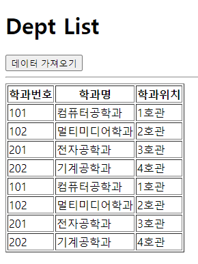
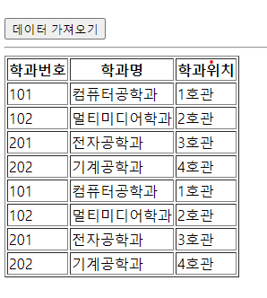

## 신승윤 과제

### 22/04/04 

연습문제1) promise 방식으로 axios를 활용한 단일행 조회

<소스코드>
````html
<!DOCTYPE html>
<html lang="en">
<head>
    <meta charset="UTF-8">
    <meta http-equiv="X-UA-Compatible" content="IE=edge">
    <meta name="viewport" content="width=device-width, initial-scale=1.0">
    <title>Document</title>
    <style type="text/css">
        #loading {
              width: 100px;
              height: 100px;
              background-image:  url(img/loading.gif);
              background-size: cover;
              background-repeat: no-repeat;
              background-position: center center;
              display: block;
              position: absolute;
              left: 50%;
              top: 50%;
              margin-left:  -50px;
              margin-top: -50px;
              z-index: 9999999999999;
              display: none;
          }
  
         #loading.active {
             display: block;
         }
  </style>
</head>

<body>
    <div id="loading"></div>
    <h1>Dept List</h1>

    <button id="btn" type="button">데이터 가져오기</button>

    <hr />

    <table border="1">
        <thead>
            <tr>
                <th>학과번호</th>
                <th>학과명</th>
                <th>학과위치</th>
            </tr>
        </thead>
        <tbody id="list-body"></tbody>
    </table>

    <script src="https://cdn.jsdelivr.net/npm/axios/dist/axios.min.js"></script>
    <script>
        document.querySelector('#btn').addEventListener('click', (e) => {
            const loading = document.querySelector('#loading');
            loading.classList.add('active');

            axios
            .get('http://localhost:3000/department')
            .then(({data}) => {
                const listBody = document.querySelector("#list-body");
                     data.map((v, i)=> {                         
                        const tr = document.createElement('tr');

                        const td1 = document.createElement('td');
                        td1.innerHTML = v.id;

                        const td2 = document.createElement('td');
                        td2.innerHTML = v.dname;

                        const td3 = document.createElement('td');
                        td3.innerHTML = v.loc;

                        tr.appendChild(td1);
                        tr.appendChild(td2);
                        tr.appendChild(td3);

                        listBody.appendChild(tr);
                                        
            })
        })
        .catch((error)=> {
            console.error(error);
            console.error(error.response.status);
            console.error(error.response.statusText);
            alert(error.response.statusText);
        })
        .finally(()=> {
            loading.classList.remove('active');
        })
    })
    </script>
</body>
</html>

````

실행결과

;

연습문제2) async~await 방식으로 axios를 활용한 단일행 조회

<소스코드>
```html
<!DOCTYPE html>
<html lang="en">
<head>
    <meta charset="UTF-8">
    <meta http-equiv="X-UA-Compatible" content="IE=edge">
    <meta name="viewport" content="width=device-width, initial-scale=1.0">
    <title>Document</title>
    <style type="text/css">
        #loading {
              width: 100px;
              height: 100px;
              background-image:  url(img/loading.gif);
              background-size: cover;
              background-repeat: no-repeat;
              background-position: center center;
              display: block;
              position: absolute;
              left: 50%;
              top: 50%;
              margin-left:  -50px;
              margin-top: -50px;
              z-index: 9999999999999;
              display: none;
          }
  
         #loading.active {
             display: block;
         }
  </style>
</head>
<body>
    <div id="loading"></div>
    <h1>Dept List</h1>

    <button id="btn" type="button">데이터 가져오기</button>

    <hr />
    <table border="1">
        <thead>
            <tr>
                <th>학과번호</th>
                <th>학과명</th>
                <th>학과위치</th>
            </tr>
        </thead>
        <tbody id="list-body"></tbody>
    </table>

    <script src="https://cdn.jsdelivr.net/npm/axios/dist/axios.min.js"></script>
    <script>
        document.querySelector('#btn').addEventListener('click', async(e) => {
            const loading = document.querySelector('#loading');
            loading.classList.add('active');

            let json;
            try {
                json = await axios.get('http://localhost:3000/department');
            }
            catch(e) {
                console.error(e);
                console.error(e.response.status);
                console.error(e.response.statusText);
                alert(e.response.statusText);
            }
            finally {
                loading.classList.remove('active');
            }

            if(json) {
                json.data.map((v, i) => {
                    const tr = document.createElement('tr');
                    const td1 = document.createElement('td');
                    td1.innerHTML = v.id;
                    const td2 = document.createElement('td');
                    td2.innerHTML = v.dname;
                    const td3 = document.createElement('td');
                    td3.innerHTML = v.loc;

                    tr.appendChild(td1);
                    tr.appendChild(td2);
                    tr.appendChild(td3);

                    document.querySelector("#list-body").appendChild(tr);
                })
            }
        })


    </script>
</body>
</html>

```

실행결과

;


