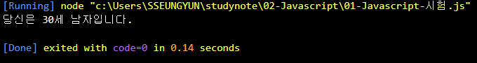
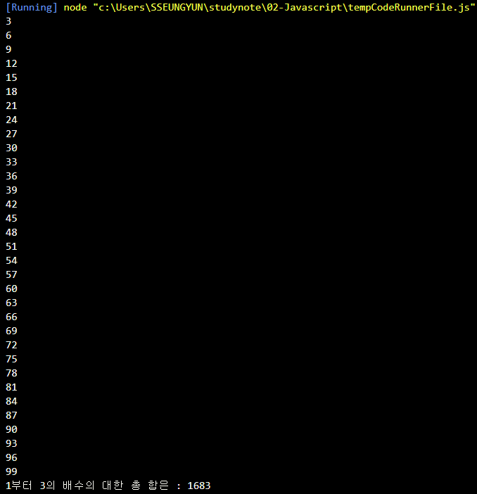
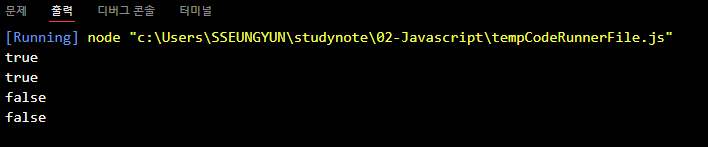
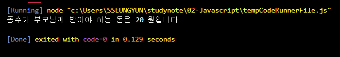

# 신승윤 Javascript 시험

## 2022-02-22
---
## 문제1

```js
const ssn = "9203211";
const date = new Date();
const now_year = date.getFullYear();

let yy = parseInt(ssn.substring(0,2));
let mm = parseInt(ssn.substring(2,4));
let dd = parseInt(ssn.substring(4,6));
let gen = parseInt(ssn.substring(7,8));


yy = (gen > 2) ? yy+2000 : yy+1900;

const age = now_year - yy ;
const sex = (gen % 2) ? "여자" : "남자";


console.log("당신은 %d세 %s입니다.", age, sex)

```

### 출력결과


---
## 문제2

```js
const number = 100;
let sum = 0;

for(i=1; i<number; i++) {
    if(i % 3 == 0) {
        console.log(i);
        sum = sum+i;
    }
}
console.log("1부터 3의 배수의 대한 총 합은 :",sum);
```

### 출력결과


---

## 문제3

```js
function solution(a){
    let strArr = a.toString().split('');
    let numSum = 0;
    for(let num = 0; num<strArr.length; num++){
      numSum += strArr[num]*1
    }
    return (a % numSum === 0)? true: false;
  }
  
  console.log(solution(10)); 
  console.log(solution(12)); 
  console.log(solution(11)); 
  console.log(solution(13)); 
 
```

### 출력결과


---

## 문제4

```js
const K = 30;
const N = 4;
const M = 100;
const cookie = K * N;
const price = cookie > M ? cookie - M : 0;
console.log("동수가 부모님께 받아야 하는 돈은 %d 원입니다", price);

```

### 출력결과


---
## 문제5

```js
class student {
       constructor() {
              this._min = null;
              this._chul = null;
              this._na = null;
              this._soo = null;
              this._young = null;
       }

       set _min(value) {
              
                     console.log("")
              }
       }


/**const grade = new Array();
*/


/**let data = [82, 76, 91, 98, 64];

let sum = 0;

for (let i=0; i < data.length; i++) sum += data[i];

let mean = sum/data.length 

console.log(mean);
*/


```

### 출력결과


