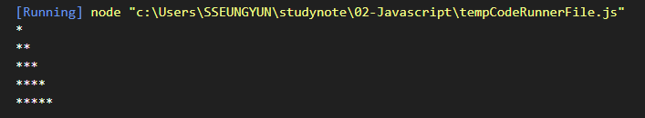
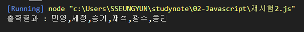
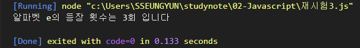
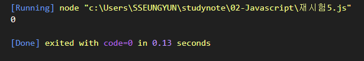
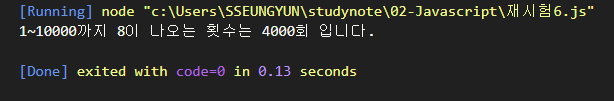

# 신승윤 Javascript 시험

## 2022-03-18 
---
## 문제1

```js
for(let i=0; i<5; i=i+1){
    let str = "";

    for(let j=0; j<i+1; j++) {
        str += "*"
    }
    console.log(str);

}


```

### 출력결과


---
## 문제2

```js
const points = [82, 91, 54, 62, 88, 90];
const names = [ '재석', '민영', '종민', '광수', '승기', '세정'];

for (let i=0; i < points.length -1; i++) {
    for (let j = i+ 1; j<points.length; j++) {
        if (points[i] < points[j]) {
            tmp = points[i];
            points[i] = points[j];
            points[j] = tmp;

            tmp = names[i];
            names[i] = names[j];
            names[j] = tmp;
        

        }
    }
}

console.log("출력결과 : " + names);
```

### 출력결과


---

## 문제3

```js
let text = 'Life is too short, You need Javascript';
let count = 0;
let search = 'e'; 
let num = text.indexOf(search); 

while (num !== -1) {
  count++;
  num = text.indexOf(search, num + 1); 
}

console.log("알파벳 e의 등장 횟수는 %d회 입니다", count);
```

### 출력결과


---

## 문제4

```js


```

### 출력결과


---
## 문제5

```js
let height = 100;
let ball = 3 / 5;

for (let i=1; i<=10; i++) {
    height = height * ball
}

console.log(parseInt(height));

```

### 출력결과


---
## 문제6

```js
function count() {
    let num = 0;
  
    for (let i = 1; i <= 10000; i++) {
      const str = i + '';
      for (let j = 0; j < str.length; j++) {
        if (str[j] === '8') 
        { ++num; }
      }
    }
    return num;
  }
  
  console.log("1~10000까지 8이 나오는 횟수는 %d회 입니다." , count());

```

### 출력결과



