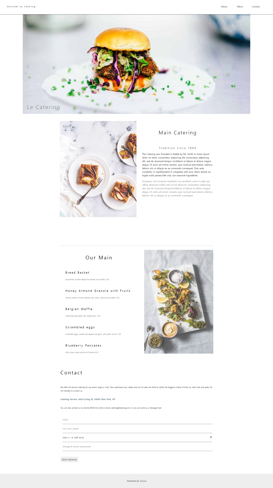

## 신승윤 React 클론코딩1 
---
### 22-04-29
---
App.js
```js
import React from "react";
import Header from "./components/Header";
import Content from "./components/Content";
import Footer from "./components/Footer";
import Main from "./components/Main";

const App = () => {
  return (
    <>
      <Header />
      <Main />
      <Content />
      <Footer />
      
    </>
  );
};

export default App;


```
---
Index.js
```js
/**
* @filename: index.js
* @description: 프로그램 시작점.
* 전역 스타일(GlobalStyles)과 전역 SEO 구성(Meta),
* 라우팅 범위를 설정(BrowserRouter)하고 프로그램을 시작(App)한다.
* @author: 신승윤 (gsh05144@gmail.com)
*/
/** 패키지 참조 */
import React from 'react';
import ReactDOM from 'react-dom/client';
// 전역 스타일 정의
import GlobalStyles from './GlobalStyles';
// SEO 구현
import Meta from './Meta';
// 라우팅 범위 설정
import {BrowserRouter} from 'react-router-dom';
// 프로그램 시작
import App from './App';

const root = ReactDOM.createRoot(document.getElementById('root'));
root.render(
<React.StrictMode>
<GlobalStyles />
<Meta />
<BrowserRouter><App /></BrowserRouter>
</React.StrictMode>
);


```

Meta.js
```js
/**
 * @filename : Meta.js
 * @description : <head> 태그 내의 SEO 처리 및 기본 참조 리소스 명시
 * @author : 신승윤 (gsh05144@naver.com)
 */
/** 패키지 참조 */
// 기본 참조 객체
import React from "react";
// SEO 처리 기능 패키지
import { Helmet, HelmetProvider } from "react-helmet-async";
/**
 * SEO 처리 컴포넌트
 * @params props
 * @return {JSX.Element}
 */
const Meta = (props) => {
  return (
    <HelmetProvider>
      <Helmet>
        <meta charSet="utf-8" />
        <title>{props.title}</title>
        <meta name="description" content={props.description} />
        <meta name="keywords" content={props.keywords} />
        <meta name="author" content={props.author} />
        <meta property="og:type" content="website" />
        <meta property="og:title" content={props.title} />
        <meta property="og:description" content={props.description} />
        <meta property="og:url" content={props.url} />
        <link rel="preconnect" href="https://fonts.googleapis.com" />
        <link rel="preconnect" href="https://fonts.gstatic.com" crossorigin />
        <link
          href="https://fonts.googleapis.com/css2?
family=Nanum+Gothic:wght@400;700&display=swap"
          rel="stylesheet"
        />
      </Helmet>
    </HelmetProvider>
  );
};
/**
* props에 대한 기본값 설정
* @type {{keywords: string, author: string, description: string, title: string,
url: string}}
*/
Meta.defaultProps = {
  title: "W3.CSS Template",
  description: "React.js로 구현한 레이아웃 데모 페이지 입니다.",
  keywords: "React, layout, demo",
  author: "신승윤",
  url: window.location.href,
};
export default Meta;


```

GlobalStyles.js
```js
/**
 * @filename: GlobalStyles.js
 * @description: 전역으로 적용될 기본 스타일시트.
 *               이 파일에서 정의한 class는 ReactJSX에서 className속성으로 참조해야 한다.
 * @author: 신승윤 (gsh05144@naver.com)
 */

/** 패키지 참조 */
import { createGlobalStyle } from "styled-components";

/**
 * 전역 스타일 시트를 정의한 객체
 * @type {GlobalStyleComponent<{}, DefaultTheme>}
 */
const GlobalStyles = createGlobalStyle`
    * {
        font-family: 'Noto Sans KR';
    }

    body {
        margin: 0;
        padding: 0;
    }
`;

export default GlobalStyles;

```

text1

```js
import React from "react";
import Img2 from "../img/tablesetting2.jpg";
import styled from "styled-components";

const Main = styled.div`
  width: 1080px;
  max-width: 100%;
  margin: auto;
  padding-top: 50px;
  border-bottom: 1px dotted gray;
  

  img {
    display: block;
    margin: auto;
    width: 50%;
    max-width: 80%;
    min-width: 30%;
    border-radius: 4px;
    float: left;
    margin-right: 40px;
    opacity: 0.8;
  }

  h2 {
    font-weight: 200;
    font-size: 35px;
    text-align: center;
    line-height: 100px;
    letter-spacing: 4px;
  }

  .text {
    max-height: 750px;
    text-overflow: ellipsis;
    overflow: hidden;

    .textSub {
      text-align: center;
      font-size: 18px;
      font-weight: 400;
      letter-spacing: 5px;
    }

    p {
      font-size: 16px;
      line-height: 25px;

      &:last-child {
        color: gray;
      }
    }
  }

  &:after {
    float: none;
    clear: both;
    content: "";
    display: block;
    padding-bottom: 200px;
  }
`;

function text1() {
  return (
    <Main>
      <div className="image">
        
      </div>
      <h2>Main Catering</h2>
      <div className="text">
        <p className="textSub">Tradition since 1889</p>
        <p>
          The Catering was founded in blabla by Mr. Smith in lorem ipsum dolor
          sit amet, consectetur adipiscing elit consectetur adipiscing elit, sed
          do eiusmod tempor incididunt ut labore et dolore magna aliqua. Ut enim
          ad minim veniam, quis nostrud exercitation ullamco laboris nisi ut
          aliquip ex ea commodo consequat. Duis aute iruredolor in reprehenderit
          in voluptate velit esse cillum dolore eu fugiat nulla pariatur.We only
          use seasonal ingredients.
        </p>
        <p>
          Excepteur sint occaecat cupidatat non proident, sunt in culpa qui
          officia deserunt mollit anim id est laborum consectetur adipiscing
          elit, sed do eiusmod temporincididunt ut labore et dolore magna
          aliqua. Ut enim ad minim veniam, quis nostrud exercitation ullamco
          laboris nisi ut aliquip ex ea commodo consequat.
        </p>
      </div>
    </Main>
  );
}

export default text1;


```

text2

```js
import React from "react";
import Img1 from "../img/tablesetting.jpg";
import styled from "styled-components";

const Main = styled.div`
  width: 1080px;
  max-width: 100%;
  margin: auto;
  
  img {
    display: block;
    margin: auto;
    width: 45%;
    max-width: 80%;
    min-width: 30%;
    border-radius: 4px;
    float: right;
    margin-left: 40px;
    opacity: 0.8;
  }

  ul {
      list-style: none;
  }

  h2 {
    font-weight: 400;
    font-size: 35px;
    text-align: center;
    line-height: 300%;
    letter-spacing: 5px;
    padding-bottom: 10px;
  }
  h3 {
    font-size: 21px;
    font-weight: 500;
    letter-spacing: 4px;
    padding-bottom: 3px;
  }

 
  p {
    font-size: 12px;
    line-height: 25px;
    padding-bottom: 30px;
    color: #5f5f5f;
  }
  &:after {
    float: none;
    clear: both;
    content: "";
    display: block;
  }
`;

const text2 = () => {
  return (
    <Main>
      
      <h2>Our Main</h2>
      <ul>
        <li>
          <h3>Bread Basket</h3>
          <p>Assortment of fresh baked fruit breads and muffins 5.50</p>
        </li>
        <li>
          <h3>Honey Almond Granola with Fruits</h3>
          <p>
            Natural cereal of honey toasted oats, raisins, almonds and dates
            7.00
          </p>
        </li>
        <li>
          <h3>Belgian Waffle</h3>
          <p>Vanilla flavored batter with malted flour 7.50</p>
        </li>
        <li>
          <h3>Scrambled eggs</h3>
          <p>
            Scrambled eggs, roasted red pepper and garlic, with green onions
            7.50
          </p>
        </li>
        <li>
          <h3>Blueberry Pancakes</h3>
          <p>With syrup, butter and lots of berries 8.50</p>
        </li>
      </ul>
    </Main>
  );
};

export default text2;


```

Contact

```js

import React from "react";
import styled from "styled-components";

const Contactcontainer = styled.div`
  display: block;
  width: 1080px;
  height: auto;
  margin: auto;
  padding-left: 10px;
  h2 {
    font-size: 35px;
    font-weight: 400;
    line-height: 300%;
    letter-spacing: 5px;
    padding-bottom: 10px;
  }

  fieldset {
      border: none;
      
  }
  p {
    font-size: 13px;
    line-height: 25px;
    font-weight: 400;
    padding-bottom: 20px;
    &:nth-child(3) {
      font-size: 15px;
      color: #667c89;
      font-weight: bolder;
    }
  }
  input {
    display: block;
    width: 100%;
    border: none;
    line-height: 60px;
    border-bottom: 1px solid #505050;
  }
  a {
    color: black;
    text-decoration: none;
    line-height: 100px;
    font-size: 0.9em;
    background-color: #eee;
    padding: 10px;
    &:hover {
      background-color: #8d8d8d;
    }
  }
`;

const Contact = () => {
  return (
    <Contactcontainer>
      <h2>Contact</h2>
      <p>
        We offer full-service catering for any event, large or small. We
        understand your needs and we will cater the food to satisfy the biggerst
        criteria of them all, both look and taste. Do not hesitate to contact
        us.
      </p>
      <p>Catering Service, 42nd Living St, 43043 New York, NY</p>
      <p>
        You can also contact us by phone 00553123-2323 or email
        catering@catering.com, or you can send us a message here:
      </p>
      <fieldset>
        <input type="text" placeholder="Name" id="name" />
        <input type="number" placeholder="How many people" />
        <input type="datetime-local" value="2020-11-16T20:00" />
        <input type="text" placeholder="Message \ Special requirements" />
      </fieldset>
      <a href="#name">SEND MESSAGE</a>
    </Contactcontainer>
  );
};

export default Contact;


```

components.js

```js

import React from 'react'
import Text1 from '../assets/text1'
import Text2 from '../assets/text2'
import Contact from '../assets/Contact'

function Content() {
  return (
    <div>
      <Text1 />
      <Text2 />
      <Contact />
     </div>
  )
}

export default Content

```

Footer.js

```js

import React from "react";
import styled from "styled-components";
const Footercontainer = styled.div`
  line-height: 100px;
  margin-top: 50px;
  background-color: #eee;
  text-align: center;
`;
const Footer = () => {
  return (
    <Footercontainer>
      <address>Powered by w3.css</address>
    </Footercontainer>
  );
};
export default Footer;


```

Header.js

```js

/**
 * @filename: Header.js
 * @description: 웹 페이지 Header
 * @author: 신승윤 (gsh05144@naver.com)
 */

import React from "react";
import styled from "styled-components";
import { NavLink } from "react-router-dom";

const HeaderContainer = styled.header`
  width: 100%;
  height: 100px;
  color: black;
  position: fixed;
  background-color: white;
  text-align: center;
  z-index: 999;
  box-shadow: 2px 0 5px;

  h1 {
    float: left;
    width: 300px;
    height: 100%;
    line-height: 70px;
    font-size: 15px;
    font-weight: 400;
    letter-spacing: 3px;
  }

  .menu {
    float: right;
    width: 400px;
    height: 60%;
  }

  a {
    float: left;
    margin: 16px 16px;
    width: 20%;
    display: block;
    text-decoration: none;
    color: black;
    height: 50px;
    line-height: 60px;

    &:hover {
      background: gray;
    }
    &:after {
      content: "";
      display: block;
      float: none;
      clear: both;
    }
  }
`;

function Header() {
  return (
    <HeaderContainer>
      <h1>Gourmet au Catering</h1>
      <div className="menu">
        <NavLink to="/">About</NavLink>
        <NavLink to="/menu">Menu</NavLink>
        <NavLink to="/Contact">Contact</NavLink>
      </div>
    </HeaderContainer>
  );
}

export default Header;


```

Main.js

```js
import React from 'react'
import styled from 'styled-components';
import Img from'../img/hamburger.jpg';
const MainContainer = styled.header`
  position: relative;
  width: 1600px;
  margin: auto;
  img {
    display: block;
    width: 100%;
    margin: auto;
    position: relative;
    z-index: -1;
  }

  h1 {
    display: block;
    font-size: 38px;
    color: gray;
    font-weight: 200;
    position: absolute;
    bottom: 0;
    left: 30px;
    letter-spacing: 4px;
  }
  &:after {
    content: "";
    display: block;
    float: none;
    clear: both;
  }
 
`;

const Main = () => {
  return (
    <div>
      <MainContainer>
        
        <h1>Le Catering</h1>
      </MainContainer>
    </div>
  )
}

export default Main


```

#### 결과


## 후기

리액트를 하다보니 Dom 구조 잡는법이 왜 중요한지 조금씩 알 것 같다.
요즘은 JS, React가 많이 부족한 것 같아 공부를 하다보니 오늘 CSS에서 약간 어려움을 겪었던게 스스로 아쉬웠다.
모든 부분에서 꾸준한 복습이 필요할 것 같다.

그리고 확실히 모든 Dom 구조를 분해하고 스타일을 정해서 import하는 방식이 더 깔끔하고 쉬웠던 것 같다.

