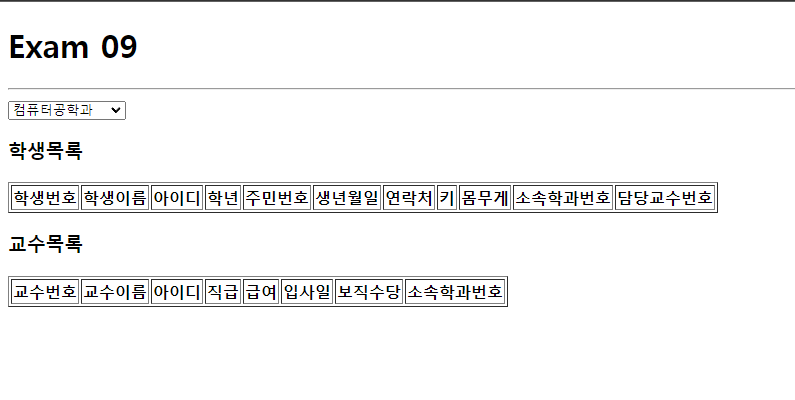
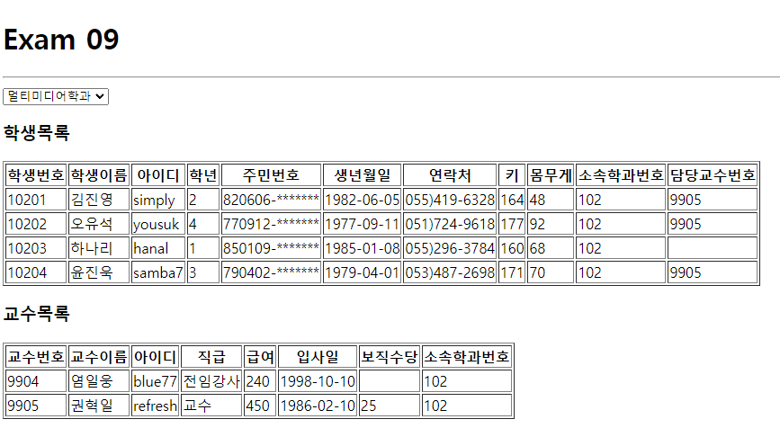

### 신승윤 연습문제
## 22.05.16 신승윤




Index.js
---
```js
import React from 'react';
import ReactDOM from 'react-dom/client';
import App from './App';


const root = ReactDOM.createRoot(document.getElementById('root'));
root.render(
  <React.StrictMode>
    <App />
  </React.StrictMode>
);


```

App.js
---
```js
import React from "react";
import Professor from "./components/Professor";
import Student from "./components/Student";
import Spinner from "./components/Spinner";
import axios from "axios";
function App() {
  const [department, setDepartment] = React.useState([]);
  const [value, setValue] = React.useState(-1);
  const [loading, setLoading] = React.useState(false);
  const change = React.useCallback((e) => {
    setValue(e.target.value);
  }, []);
  React.useEffect(() => {
    setLoading(true);
    (async () => {
      try {
        const resopnse = await axios.get("http://localhost:3001/department");
        setDepartment(resopnse.data);
      } catch (e) {
        console.error(e);
        alert("Ajax 통신 오류");
      } finally {
        setLoading(false);
      }
    })();
  }, []);
  return (
    <div>
      <Spinner visible={loading} />
      <h1>Exam 09</h1>
      <hr />
      <select onChange={change}>
        {department.map((v, i) => {
          return (
            <option key={i} value={v.id}>
              {v.dname}
            </option>
          );
        })}
      </select>
      <Student deptno={value} />
      <Professor deptno={value} />
    </div>
  );
}
export default App;
```

Student.js
---
```js
import React, { useState, useEffect } from "react";
import axios from "axios";
import Spinner from "./Spinner";
const Student = ({ deptno }) => {
  const [visible, setVisible] = useState(false);
  const [student, setStudent] = useState([]);
  useEffect(() => {
    if (deptno > -1) {      
      setVisible(true);
      (async () => {
        try {
          const response = await axios.get(
            `http://localhost:3001/student?deptno=${deptno}`
          );
          setStudent((student) => response.data);
        } catch (e) {
          console.errer(e);
          console.log("Ajax 연동 실패");
        } finally {
          setVisible(false);
        }
      })();
    }
  }, [deptno]);
  return (
    <div>
      <h3>학생목록</h3>
      <table border="1">
        <thead>
          <tr>
            <th>학생번호</th>
            <th>학생이름</th>
            <th>아이디</th>
            <th>학년</th>
            <th>주민번호</th>
            <th>생년월일</th>
            <th>연락처</th>
            <th>키</th>
            <th>몸무게</th>
            <th>소속학과번호</th>
            <th>담당교수번호</th>
          </tr>
        </thead>
        <tbody>
          {student.map((v, i) => {
            return (
              <tr key={i}>
                <td>{v.id}</td>
                <td>{v.name}</td>
                <td>{v.userid}</td>
                <td>{v.grade}</td>
                <td>{v.idnum.substring(0, 6)}-*******</td>
                <td>{v.birthdate.substring(0, 10)}</td>
                <td>{v.tel}</td>
                <td>{v.height}</td>
                <td>{v.weight}</td>
                <td>{v.deptno}</td>
                <td>{v.profno}</td>
              </tr>
            );
          })}
        </tbody>
      </table>
      <Spinner visible={visible} />
    </div>
  );
};
export default Student;


```

Professor.js
---
```js
import React, { useState, useEffect } from "react";
import axios from "axios";
import Spinner from "./Spinner";
const Professor = ({ deptno }) => {
  const [visible, setVisible] = useState(false);
  const [professor, setProfessor] = useState([]);
  useEffect(() => {
    if (deptno > -1) {
      setProfessor((student) => student.filter((v, i) => v.id === deptno));
      setVisible(true);
      (async () => {
        try {
          const response = await axios.get(
            `http://localhost:3001/professor?deptno=${deptno}`
          );
          setProfessor((professor) => response.data);
        } catch (e) {
          console.errer(e);
          console.log("Ajax 연동 실패");
        } finally {
          // 로딩 종료
          setVisible(false);
        }
      })();
    }
  }, [deptno]);
  return (
    <div>
      <h3>교수목록</h3>
      <table border="1">
        <thead>
          <tr>
            <th>교수번호</th>
            <th>교수이름</th>
            <th>아이디</th>
            <th>직급</th>
            <th>급여</th>
            <th>입사일</th>
            <th>보직수당</th>
            <th>소속학과번호</th>
          </tr>
        </thead>
        <tbody>
          {professor.map((v, i) => {
            return (
              <tr key={i}>
                <td>{v.id}</td>
                <td>{v.name}</td>
                <td>{v.userid}</td>
                <td>{v.position}</td>
                <td>{v.sal}</td>
                <td>{v.hiredate.substring(0, 10)}</td>
                <td>{v.comm}</td>
                <td>{v.deptno}</td>
              </tr>
            );
          })}
        </tbody>
      </table>
      <Spinner visible={visible} />
    </div>
  );
};
export default Professor;
```

Spinner.js
---
```js
import React from "react";
import PropTypes from "prop-types";
import styled from "styled-components";
// 로딩바 컴포넌트
import { Bars } from "react-loader-spinner";
// 로딩바 뒤에 표시될 반투명 배경
const TransLayer = styled.div`
  position: fixed;
  left: 0;
  top: 0;
  z-index: 9999;
  background-color: #0003;
  width: 100%;
  height: 100%;
`;
const Spinner = ({ visible, color, width, height }) => {
  return (
    <div>
      {visible && (
        <TransLayer>
          <Bars
            color={color}
            height={height}
            width={width}
            wrapperStyle={{
              position: "absolute",
              zIndex: 10000,
              left: "50%",
              top: "50%",
              marginLeft: -width / 2 + "px",
              marginTop: -width / 2 + "px",
            }}
          />
        </TransLayer>
      )}
    </div>
  );
};
// 기본값 정의
Spinner.defaultProps = {
  visible: false,
  color: "#06f",
  width: 100,
  height: 100,
};
// 데이터 타입 설정
Spinner.propTypes = {
  visible: PropTypes.bool.isRequired,
  color: PropTypes.string,
  width: PropTypes.number,
  height: PropTypes.number,
};
export default Spinner;
```