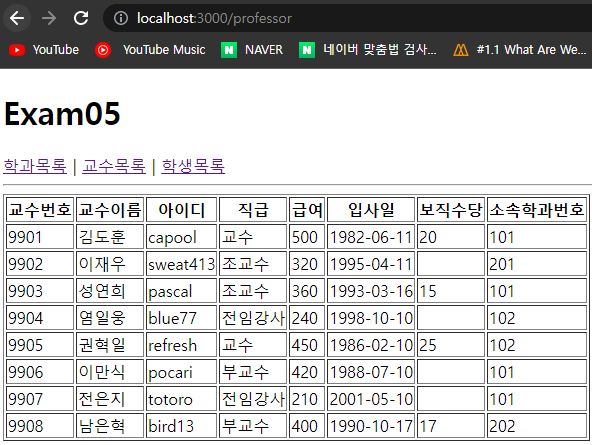
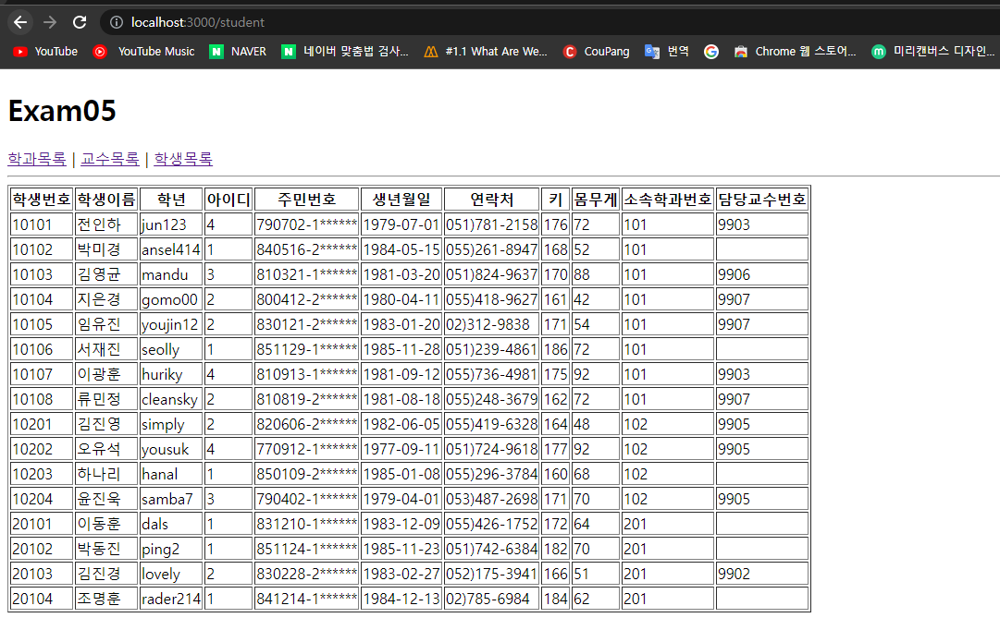

## 신승윤 연습문제 5
---
App.js
```js
import React from "react";
import { Link, Routes, Route } from "react-router-dom";
import Department from "./pages/Department";
import Professor from "./pages/Professor";
import Student from "./pages/Student";
function App() {
  return (
    <div>
      <h1>Exam05</h1>
      <nav>
        <Link to="/department">학과목록</Link>&nbsp;|&nbsp;
        <Link to="/professor">교수목록</Link>&nbsp;|&nbsp;
        <Link to="/student">학생목록</Link>
      </nav>
      <hr />
      <Routes>
        <Route path="/department" element={<Department />} />
        <Route path="/professor" element={<Professor />} />
        <Route path="/student" element={<Student />} />
      </Routes>
    </div>
  );
}
export default App;

```
---
Index.js
```js
import React from "react";
import ReactDOM from "react-dom/client";
import { BrowserRouter } from "react-router-dom";
import App from "./App";
const root = ReactDOM.createRoot(document.getElementById("root"));
root.render(
  <React.StrictMode>
    <BrowserRouter>
      <App />
    </BrowserRouter>
  </React.StrictMode>
);

```
Department.js
```js
import React from "react";
import DepartmentSub from "../components/DepartmentSub";
import myschool from "../myschool";
const Department = () => {
  const { department } = myschool;
  return (
    <div>
      <table border="1">
        <thead>
          <tr>
            <th>학과번호</th>
            <th>학과이름</th>
            <th>위치</th>
          </tr>
        </thead>
        <tbody>
          {department.map((v, i) => {
            return (
              <DepartmentSub key={i} id={v.id} dname={v.dname} loc={v.loc} />
            );
          })}
        </tbody>
      </table>
    </div>
  );
};
export default Department;

```

DepartmentSub.js
```js
import React from "react";
const DepartmentSub = ({ id, dname, loc }) => {
  return (
    <tr>
      <td>{id}</td>
      <td>{dname}</td>
      <td>{loc}</td>
    </tr>
  );
};
export default DepartmentSub;

```

Professor.js
```js
import React from "react";
import ProfessorSub from "../components/ProfessorSub";
import myschool from "../myschool";
const Professor = () => {
  const { professor } = myschool;
  return (
    <div>
      <table border="1">
        <thead>
          <tr>
            <th>교수번호</th>
            <th>교수이름</th>
            <th>아이디</th>
            <th>직급</th>
            <th>급여</th>
            <th>입사일</th>
            <th>보직수당</th>
            <th>소속학과번호</th>
          </tr>
        </thead>
        <tbody>
          {professor.map((v, i) => {
            return (
              <ProfessorSub
                key={i}
                id={v.id}
                name={v.name}
                userid={v.userid}
                position={v.position}
                sal={v.sal}
                hiredate={v.hiredate}
                comm={v.comm}
                deptno={v.deptno}
              />
            );
          })}
        </tbody>
      </table>
    </div>
  );
};
export default Professor;

```

ProfessorSub.js

```js
import React from "react";
const ProfessorSub = ({
  id,
  name,
  userid,
  position,
  sal,
  hiredate,
  comm,
  deptno,
}) => {
  return (
    <tr>
      <td>{id}</td>
      <td>{name}</td>
      <td>{userid}</td>
      <td>{position}</td>
      <td>{sal}</td>
      <td>{hiredate.substring(0, 10)}</td>
      <td>{comm}</td>
      <td>{deptno}</td>
    </tr>
  );
};
export default ProfessorSub;

```

Student.js

```js
import React from "react";
import StudentSub from "../components/StudentSub";
import myschool from "../myschool";
const Student = () => {
  const { student } = myschool;
  return (
    <div>
      <table border="1">
        <thead>
          <tr>
            <th>학생번호</th>
            <th>학생이름</th>
            <th>학년</th>
            <th>아이디</th>
            <th>주민번호</th>
            <th>생년월일</th>
            <th>연락처</th>
            <th>키</th>
            <th>몸무게</th>
            <th>소속학과번호</th>
            <th>담당교수번호</th>
          </tr>
        </thead>
        <tbody>
          {student.map((v, i) => {
            return (
              <StudentSub
                key={i}
                id={v.id}
                name={v.name}
                userid={v.userid}
                grade={v.grade}
                idnum={v.idnum}
                birthdate={v.birthdate}
                tel={v.tel}
                height={v.height}
                weight={v.weight}
                deptno={v.deptno}
                profno={v.profno}
              />
            );
          })}
        </tbody>
      </table>
    </div>
  );
};
export default Student;


```

StudentSub.js
```js
import React from "react";
const Student = ({
  id,
  name,
  userid,
  grade,
  idnum,
  birthdate,
  tel,
  height,
  weight,
  deptno,
  profno,
}) => {
  return (
    <tr>
      <td>{id}</td>
      <td>{name}</td>
      <td>{userid}</td>
      <td>{grade}</td>
      <td>{idnum.substring(0,6) + "-" + idnum.substring(6,7) + "******"}</td>
      <td>{birthdate.substring(0,10)}</td>
      <td>{tel}</td>
      <td>{height}</td>
      <td>{weight}</td>
      <td>{deptno}</td>
      <td>{profno}</td>
    </tr>
  );
};
export default Student;

```
#### Department 실행결과


#### Professor 실행결과


#### Student 실행결과


