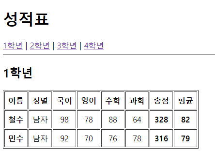
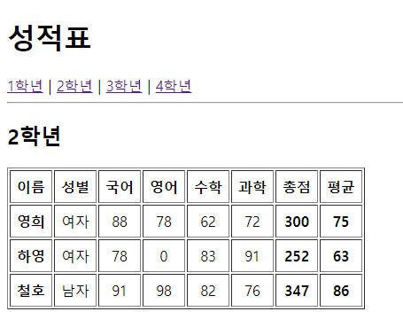
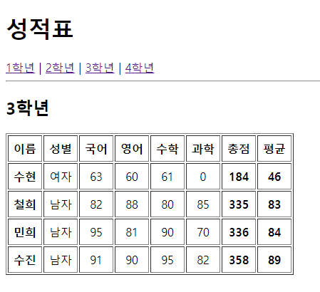

## 신승윤 연습문제 
---
### 22-04-27
---
App.js
```js
import React from "react";
import { Link, Routes, Route } from "react-router-dom";
import GradeTable from "./pages/GradeTable";
import Meta from "./components/Meta";
const App = () => {
  return (
    <div>
      <Meta />
      <h1>성적표</h1>
      <nav>
        <Link to="/grade_table/1">1학년</Link>&nbsp;|&nbsp;
        <Link to="/grade_table/2">2학년</Link>&nbsp;|&nbsp;
        <Link to="/grade_table/3">3학년</Link>&nbsp;|&nbsp;
        <Link to="/grade_table/4">4학년</Link>
      </nav>
      <hr />

      <Routes>
        <Route path="/grade_table/:grade" element={<GradeTable />} />
      </Routes>
    </div>
  );
};
export default App;


```
---
Index.js
```js
import React from 'react';
import ReactDOM from 'react-dom/client';
import App from './App';
import { BrowserRouter } from 'react-router-dom';


const root = ReactDOM.createRoot(document.getElementById('root'));
root.render(
  <React.StrictMode>
    <BrowserRouter>
      <App />
    </BrowserRouter>
  </React.StrictMode>
);


```

GradeItem.js
```js
import React from "react";
import PropTypes from "prop-types";
const GradeItem = ({ name, level, sex, kor, eng, math, sinc }) => {
  const sum = parseInt(kor + eng + math + sinc);
  const avg = parseInt(sum / 4);
  return (
    <tr align="center">
      <td>
        <strong>{name}</strong>
      </td>
      <td>{sex}</td>
      <td>{kor}</td>
      <td>{eng}</td>
      <td>{math}</td>
      <td>{sinc}</td>
      <td>
        <strong>{sum}</strong>
      </td>
      <td>
        <strong>{avg}</strong>
      </td>
    </tr>
  );
};
GradeItem.propTypes = {
  name: PropTypes.string.isRequired,
  sex: PropTypes.string.isRequired,
};
GradeItem.defaultProps = {
  kor: 0,
  eng: 0,
  math: 0,
  sinc: 0,
};
export default GradeItem;


```

Meta.js
```js
import React from "react";
import { Helmet } from "react-helmet";
const Meta = (props) => {
  return (
    <Helmet>
      <meta charset="utf-8" />
      <title>{props.title}</title>
      <meta name="description" content={props.description} />
      <meta name="keywords" content={props.keywords} />
      <meta name="author" content={props.author} />
      <meta property="og:type" content="website" />
      <meta property="og:title" content={props.title} />
      <meta property="og:description" content={props.description} />
      <meta property="og:url" content={props.url} />
    </Helmet>
  );
};

Meta.defaultProps = {    
  title: "React 연습문제",
  description: "React 연습문제 입니다.",
  keywords: "React",
  author: "작성자",
  url: window.location.href,
};
export default Meta;

```

GradeTable.js

```js
import React from "react";
import { useParams } from "react-router-dom";
import GradeItem from "../components/GradeItem";
import Meta from "../components/Meta";
import GradeData from "../GradeData";
const GradeTable = () => {
  const { grade } = useParams();

  const key = `${grade}학년`;

  const currentData = GradeData[key];
  return (
    <div>
      <Meta title={`${key} ::: React 연습문제`} />
      <h2>{key}</h2>
      <table border="1" cellPadding="7">
        <thead>
          <tr align="center">
            <th>이름</th>
            <th>성별</th>
            <th>국어</th>
            <th>영어</th>
            <th>수학</th>
            <th>과학</th>
            <th>총점</th>
            <th>평균</th>
          </tr>
        </thead>
        <tbody>
          {currentData.map((v, i) => {
            return (
              <GradeItem
                key={i}
                name={v.이름}
                sex={v.성별}
                kor={v.국어}
                eng={v.영어}
                math={v.수학}
                sinc={v.과학}
              />
            );
          })}
        </tbody>
      </table>
    </div>
  );
};
export default GradeTable;


```

#### 1학년 실행결과


#### 2학년 실행결과


#### 3학년 실행결과


#### 4학년 실행결과


