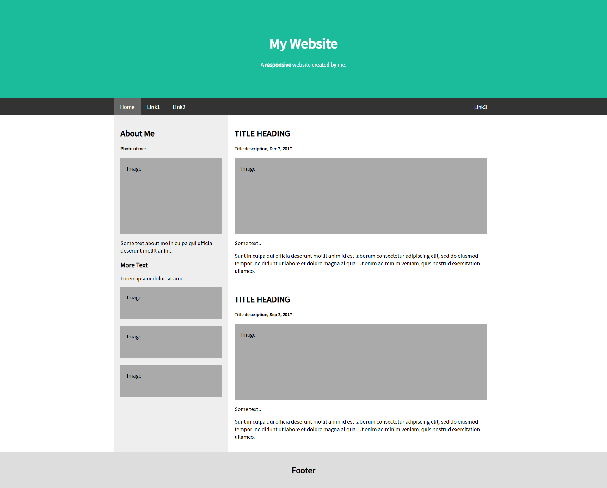

## 신승윤 연습문제 
---
### 22-04-28
---


App.js
```js
import React from 'react';
import { Routes, Route } from 'react-router-dom';

import GlobalStyles from './components/GlobalStyles';
import Meta from './components/Meta';
import Header from './components/Header';
import Footer from './components/Footer';

import Content from './pages/Content';

const App = () => {
    return (
        <div>
            <Meta />
            <GlobalStyles />
            
            <Header />
            
            <Routes>
                <Route path='/' export={true} element={<Content />} />
            </Routes>

            <Footer />
        </div>
    );
};

export default App;
```
---
Index.js
```js
import React from 'react';
import ReactDOM from 'react-dom/client';
import App from './App';
import { BrowserRouter } from 'react-router-dom';

const root = ReactDOM.createRoot(document.getElementById('root'));
root.render(
    <React.StrictMode>
        <BrowserRouter>
            <App />
        </BrowserRouter>
    </React.StrictMode>
);
```

Content.js
```js
import React from 'react';
import styled from 'styled-components';

import Side from '../components/Side';
import Main from '../components/Main';

const ContentContainer = styled.section`
    max-width: 1200px;
    margin: auto;
    background-color: #eee;
    display: flex;
    flex-wrap: nowrap;
    flex-direction: row;
`;

const Content = () => {
    return (
        <ContentContainer>
            <Side />
            <Main />
        </ContentContainer>
    );
};

export default Content;
```

Meta.js
```js
import React from 'react';
import { Helmet } from 'react-helmet';

const Meta = (props) => {
    return (
        <Helmet>
            <meta charset='utf-8' />
            <title>{props.title}</title>
            {/* SEO 태그 */}
            <meta name='description' content={props.description} />
            <meta name='keywords' content={props.keywords} />
            <meta name='author' content={props.author} />
            <meta property='og:type' content='website' />
            <meta property='og:title' content={props.title} />
            <meta property='og:description' content={props.description} />
            <meta property='og:image' content={props.image} />
            <meta property='og:url' content={props.url} />
            <link rel="preconnect" href="https://fonts.googleapis.com" />
            <link rel="preconnect" href="https://fonts.gstatic.com" crossorigin />
            <link href="https://fonts.googleapis.com/css2?family=Gugi&family=Noto+Sans+KR:wght@100;300;400;500&display=swap" rel="stylesheet" /> 
        </Helmet>
    );
};

Meta.defaultProps = {
    title: 'React Example',
    description: 'React.js 예제 입니다.',
    keywords: 'React',
    author: '신승윤',
    url: window.location.href
};

export default Meta;
```


Header.js
```js
import React from 'react';
import styled from 'styled-components';
import { NavLink } from 'react-router-dom';

const HeaderContainer = styled.header`
    .jumbotron {
        padding: 80px;
        text-align: center;
        background: #1abc9c;
        color: white;

        h1 {
            font-size: 40px;
        }
    }
`;

const NavContainer = styled.nav`
    overflow: hidden;
    background-color: #333;
    position: sticky;
    top: 0;

    div {
        max-width: 1200px;
        margin: auto;
        display: flex;
        flex-direction: row;
        flex-wrap: nowrap;
        justify-content: flex-start;

        a {
            display: block;
            color: white;
            text-align: center;
            padding: 14px 20px;
            text-decoration: none;

            &:hover {
                background-color: #ddd;
                color: black;
            }

            &.active {
                background-color: #666;
                color: white;
            }

            &.right {
                margin-left: auto;
            }
        }
    }
`;

const Header = () => {
    return (
        <div>
            <HeaderContainer>
                <div className="jumbotron">
                    <h1>My Website</h1>
                    <p>A <b>responsive</b> website created by me.</p>
                </div>
            </HeaderContainer>

            <NavContainer>
                <div>
                    <NavLink to="/">Home</NavLink>
                    <NavLink to="/link1">Link1</NavLink>
                    <NavLink to="/link2">Link2</NavLink>
                    <NavLink to="/link3" className="right">Link3</NavLink>
                </div>
            </NavContainer>
        </div>
    );
};

export default Header;
```

Main.js

```js
import React from 'react';
import styled from 'styled-components';

import FakeImg from './FakeImg';

const MainContainer = styled.div`
    flex: 0 1 auto;
    background-color: white;
    border-right: 1px solid #d5d5d5;
`;

const Main = () => {
    return (
        <MainContainer>
            <div class="container">
                <h2>TITLE HEADING</h2>
                <h5>Title description, Dec 7, 2017</h5>
                <FakeImg height='200'>Image</FakeImg>
                <p>Some text..</p>
                <p>Sunt in culpa qui officia deserunt mollit anim id est laborum consectetur adipiscing elit, sed do eiusmod tempor incididunt ut labore et dolore magna aliqua. Ut enim ad minim veniam, quis nostrud exercitation ullamco.</p>
                <br />
                <h2>TITLE HEADING</h2>
                <h5>Title description, Sep 2, 2017</h5>
                <FakeImg height='200'>Image</FakeImg>
                <p>Some text..</p>
                <p>Sunt in culpa qui officia deserunt mollit anim id est laborum consectetur adipiscing elit, sed do eiusmod tempor incididunt ut labore et dolore magna aliqua. Ut enim ad minim veniam, quis nostrud exercitation ullamco.</p>
            </div>
        </MainContainer >
    );
};

export default Main;

```

Side.js
```js
import React from 'react';
import styled from 'styled-components';

import FakeImg from './FakeImg';

const SideContainer = styled.div`
    width: 360px;
    flex: none;
    border-left: 1px solid #d5d5d5;
    border-right: 1px solid #d5d5d5;
`;

const Side = () => {
    return (
        <SideContainer>
            <div class="container">
                <h2>About Me</h2>
                <h5>Photo of me:</h5>
                <FakeImg height='200'>Image</FakeImg>
                <p>Some text about me in culpa qui officia deserunt mollit anim..</p>
                <h3>More Text</h3>
                <p>Lorem ipsum dolor sit ame.</p>
                <FakeImg height='60'>Image</FakeImg>
                <br />
                <FakeImg height='60'>Image</FakeImg>
                <br />
                <FakeImg height='60'>Image</FakeImg>
            </div>
        </SideContainer>
    );
};

export default Side;
```

FakeImg.js

```js
import React from 'react';
import styled from 'styled-components';

const FakeImgContainer = styled.div`
    background-color: #aaa;
    width: auto;
    padding: 20px;
    height: ${props => `${props.height}px`}
`;

const FakeImg = ({height, children}) => {
    return (
        <FakeImgContainer height={height}>
            {children}
        </FakeImgContainer>
    );
};

export default FakeImg;
```

globalStyle.js
```js
import { createGlobalStyle } from "styled-components";

const GlobalStyles = createGlobalStyle`
    * {
        font-family: 'Noto Sans KR';
    }

    body {
        margin: 0;
        padding: 0;
    }

    .container {
        padding: 20px;
    }
`;

export default GlobalStyles;
```

#### 실행결과



